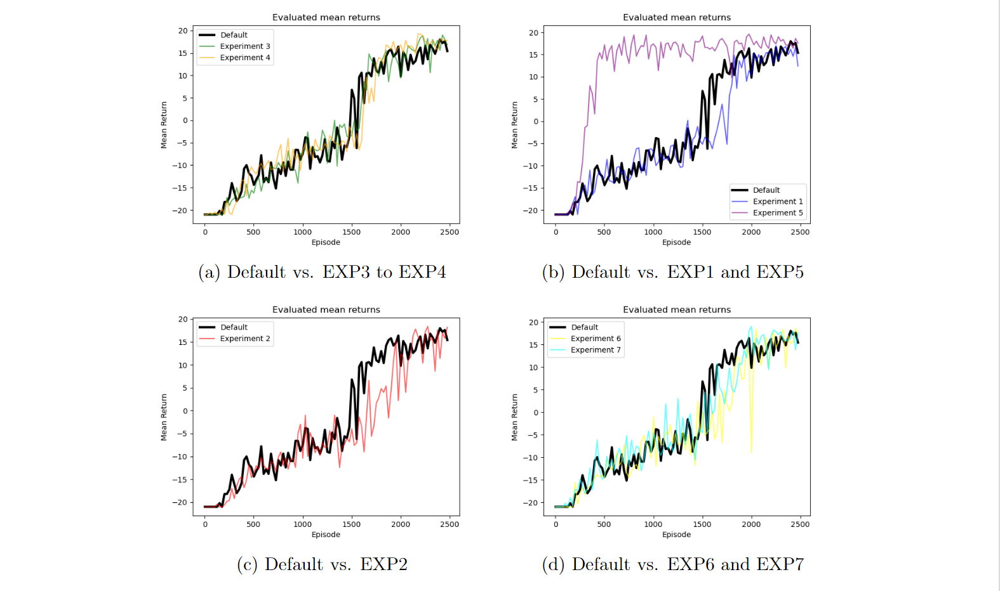

# Training Deep Q-Networks to Play CartPole and Atari Pong

## Overview
Contained within this repository is our implementation tackling a project from the Reinforcement Learning course (7.5 ECTS - 1RT747) at Uppsala University. The project focuses on deploying a Deep Q-Network (DQN) to tackle reinforcement learning challenges across two distinct environments: CartPole and Pong. DQN employs a neural network to approximate the Q-value function, enabling it to map more complex state-action spaces to optimal Q-values while ensuring effective usage of memory and computational resources.

### Cartpole

We present the training results of our DQN agent in the Cartpole-v1. The environment provides observations as an array of four floating point numbers describing the position and velocity of the cart as well as the angular position and angular velocity of the pole. The reward is a scalar value of +1 for each time step in which the pole remains upright. The maximum possible total reward for an episode is 500. The cart can perform two actions: Movement to the right or left.

#### Hyperparameter Experiments
Various adjustments were made to the hyperparameters during training.These insights into the effects of hyperparameter adjustments will inform future refinements of the DQN agent for more challenging environments.
Our initial DQN agent was trained using default hyperparameters. The mean return of the agent stabilizes between 400 and 500 over 1000 episodes, demonstrating successful learning of the task. 

|                    | batch\_size | target\_update\_freq | gamma | lr      | eps\_start | eps\_end | anneal\_length | **final\_return** | **best\_return** |
|--------------------|-------------|----------------------|-------|---------|------------|----------|----------------|-------------------|------------------|
| Default            | 32          | 100                  | 0.95  | 0.0001  | 1.0        | 0.05     | 10000          | 439.4             | 500.0            |
| Exp1               | 32          | 100                  | 0.95  | 0.0001  | 1.0        | **0.01** | 10000          | 244.6             | 433.8            |
| Exp2               | **64**      | 100                  | 0.95  | 0.0001  | 1.0        | 0.05     | 10000          | 253.2             | 410.8            |
| Exp3               | 32          | **10**               | 0.95  | 0.0001  | 1.0        | 0.05     | 10000          | 485.8             | 499.0            |
| Exp4               | 32          | **1000**             | 0.95  | 0.0001  | 1.0        | 0.05     | 10000          | 175.6             | 379.6            |
| Exp5               | 32          | 100                  | 0.95  | **0.001**| 1.0        | 0.05     | 10000          | 241.2             | 500.0            |

- Experiment 1: Decreasing epsilon end value had minimal impact on training performance.
- Experiment 2: Increasing batch size led to more stable training but slower convergence.
- Experiment 3: Reducing target update frequency improved performance by allowing more frequent updates between target and evaluation networks.
- Experiment 4: Increasing target update frequency hindered learning due to infrequent updates.
- Experiment 5: Increasing the learning rate resulted in unstable training dynamics. 

### Pong

Within this section, we explore the training outcomes of our agent in the ALE/Pong-v5
environment. The agent’s observations are represented by a stack of four consecutive frames, which are essential for perceiving motion and accurately predicting the ball’s trajectory. The agent receives a score of +1 for every point scored against the opponent, and -1 for every point scored by the opponent. The game continues until one player reaches a score of 21. In this environment, the agent has three possible actions: move the paddle up, move it down or no movement.

#### Hyperparameter Experiments
In the following, we performed 7 experiments in which we changed individual hyperparameter values separately and in combination, while leaving the other parameters at their default settings. At the end, based on the model that performed best, we continued the training on that model with fine-tuned parameters. An overview of the hyperparameters used and the corresponding final mean and best mean return value after 2500 episodes can be found in the table. The results are shown in Figure.

| Parameter     | memory\_size | n\_episodes | tar\_upd\_fre | gamma | lr       | eps\_start | eps\_end | ann\_length | n\_actions | final\_return | best\_return |
|---------------|--------------|-------------|---------------|-------|----------|------------|----------|-------------|------------|---------------|--------------|
| Def           | 10000        | 1000        | 1000          | 0.99  | 0.0001   | 1.0        | 0.01     | 10^6        | 2          | 15.4          | 18           |
| Exp1          | 10000        | 2500        | **4000**      | 0.99  | **0.00009**| 1.0        | 0.01     | 10^6        | 2          | 12.4          | 17           |
| Exp2          | 10000        | 2500        | 1000          | **0.95**| 0.0001   | 1.0        | 0.01     | 10^6        | 2          | 18.2          | 18.6         |
| Exp3          | **100000**   | 2500        | **4000**      | 0.99  | 0.0001   | 1.0        | 0.01     | 10^6        | 2          | 16.8          | 19           |
| Exp4          | **100000**   | 2500        | **8000**      | 0.99  | 0.0001   | 1.0        | 0.01     | 10^6        | 2          | 17.8          | 19.2         |
| Exp5          | 10000        | **3000**    | 1000          | 0.99  | 0.0001   | 1.0        | 0.01     | **10^4**    | 2          | 17.6          | **19.6**     |
| Exp6          | 10000        | 2500        | 1000          | **0.95**| 0.0001   | 1.0        | 0.01     | 10^6        | **3**          | 17.2          | 18.6         |
| Exp7          | 10000        | 2500        | **100**       | **0.95**| 0.0001   | 1.0        | 0.01     | 10^6        | **3**      | 17.6          | 19           |

- Experiment 1: Lowered learning rate slows convergence; target update frequency increase hinders learning.
- Experiment 2: Lowered discount factor affects long-term rewards, yielding slower, less stable training dynamics.
- Experiment 3: Enlarged replay memory and less frequent target updates stabilize training, albeit with slower learning.
- Experiment 4: Further reduced target update frequency, showing minimal impact on training dynamics.
- Experiment 5: Faster decay rate of exploration leads to quicker exploitation, potentially risking insufficient exploration.
- Experiment 6: Increased action space from two to three shows minor impact on training stability and performance.
- Experiment 7: More frequent target updates and larger action space accelerate learning without destabilizing training.
- Fine-tuning of best model (Experiment 7) with reduced learning rate to 1e-6, batch size 64 , and lowered epsilon start from 0.5 to 0.05 yields remarkable average return of 19.8, validating the efficacy of our optimizations. 

## Project Members:
- S.Moniba Ravan
- Chen Gu
- André Ramos Ekengren
- Nora Derner
